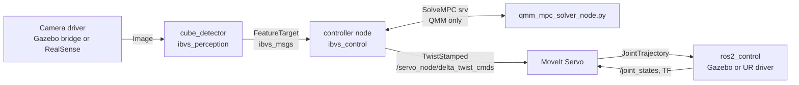

# UR5 TS-IBVS — ROS 2 Jazzy

Image-Based Visual Servoing (IBVS) of a UR5 with a wrist-mounted Intel D435,
tracking a red cube. ROS 2 Jazzy port of the ROS 1 Noetic project, fully
Dockerized (runs on Ubuntu 20.04 hosts), with four interchangeable controllers:

| Controller | `controller:=` | Method |
|---|---|---|
| TS-PDC LMI (discrete) | `ts_lmi_d` | Takagi–Sugeno PDC, discrete-time LMI gains, guaranteed decay |
| TS-PDC LMI (continuous) | `ts_lmi_c` | Takagi–Sugeno PDC, continuous-time LMI gains |
| Classic IBVS | `classic` | Levenberg–Marquardt damped pseudo-inverse (Chaumette) |
| QMM-MPC | `qmm` | One-step min-max MPC over TP-model vertices (SDP, CVXPY/CLARABEL) |

## Architecture



Separation of concerns: perception owns pixels (detection, corner ordering,
temporal matching, depth sampling, PnP); controllers own control law math only;
`TwistCommander` re-expresses camera twists into `base_link` for MoveIt Servo.

## Packages

- `ibvs_msgs` — `FeatureTarget` message, `SolveMPC` service.
- `ibvs_perception` — `cube_detector_node`: HSV segmentation, D4-group corner
  matching, depth/PnP/area depth estimation, debug overlay image.
- `ibvs_control` — the four controller nodes, shared headers (interaction
  matrices, TS memberships, gains loader, data recorder, convergence monitor,
  visualization), MPC solver service, offline LMI synthesis scripts, launch
  files, configs.
- `ur5e_ts_ibvs_description` — UR5 + Robotiq 85 + D435 URDF, Gazebo Harmonic
  world with the red cube, sim bringup.

## Quick start

```bash
./run.sh build        # build the Docker image (compiles the workspace)
./run.sh sim          # terminal 1: Gazebo + UR5 + camera + cube
./run.sh pose         # move the arm to the viewing pose
./run.sh ts_lmi_d     # terminal 2: detector + controller + MoveIt Servo
```

Any launch argument can be appended, e.g.:

```bash
./run.sh ts_lmi_d gains_file:=/ros2_ws/install/ibvs_control/share/ibvs_control/config/ts_pdc_lmi_discrete_gains.yaml
./run.sh qmm cube_size_x:=0.075 cube_size_y:=0.060
```

## Real robot (UR5 @ 192.168.1.133 + RealSense D435)

```bash
./run_ts_ibvs_real.sh                          # TS-PDC LMI discrete
./run_ibvs_classic_real.sh                     # classic IBVS
./run_qmm_ibvs_real.sh                         # QMM-MPC
# camera mount offset (tool0 -> camera_color_optical_frame):
./run_ts_ibvs_real.sh mount_z:=0.05 mount_pitch:=0.02
```

These start the UR driver, RealSense node, static mount TF, MoveIt Servo and
the controller in one shot (`mode:=real`). Real cube: 7.5 x 6.0 cm →
`cube_size_x:=0.075 cube_size_y:=0.060`.

## Offline gain synthesis (TS-PDC discrete)

```bash
./run.sh run   # shell in the container
python3 /ros2_ws/src/ibvs_control/scripts/solve_ts_pdc_lmi_discrete.py \
    --Ts 0.033 --Z0 0.5 --Zmin 0.2 --Zmax 1.0 \
    --output /ros2_ws/src/ibvs_control/config/ts_pdc_lmi_discrete_gains.yaml
```

The controller re-verifies the discrete Lyapunov conditions at startup and
refuses to run on infeasible gains.

## Data logging

Every controller writes a CSV via `DataRecorder` to `~/ibvs_logs/` inside the
container (mounted from the host, see docker-compose.yml): errors, Lyapunov
function, commanded twist, feature/desired pixels, EE pose, joint states, TS
memberships, solver stats. `./run.sh plotjuggler` for live plots
(see src/ibvs_control/config/plotjuggler_layout.md).

## Tests

```bash
./run.sh test   # gtest: corner matching, IBVS math, gains loader
                # pytest: discrete LMI synthesis feasibility + Lyapunov check
```
