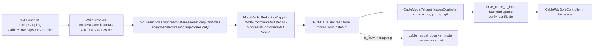

# SOFA strain-POD (MOR) pipeline for the cable TS-PDC

Status: **mechanical model, POD and ROM rebuilt on 2026-10-09** (sections 1-3 and
8-9 describe the current chain; sections 4-7 describe the TS/observer/LMI stages
as they were run on the previous model and are not re-run yet: their artifacts
carry the old basis hash and are refused by `modal_contract`). Every number is
measured (`artifacts/cable_mor/*.yaml`). One host command runs it all and stops
at the first unsatisfied gate:

```bash
./scripts/run.sh cable_sofa_mor_pipeline     # ~1 h on the 7 GB host, idle
```

Each phase is also a command (`./scripts/run.sh cable_sofa_<phase>`), prints one
`CABLE_SOFA_<PHASE>_PASSED|FAILED` line and exits non-zero on failure:
`mor_plugin_test`, `mor_snapshots`, `mor_compute_modes`, `mor_validate`,
`modal_dataset`, `modal_ts_identify`, `modal_lmi`, `pdc_test`,
`modal_observer_test`. Settings and gate thresholds live in
[cable_mor.yaml](../src/cable_ts_control/config/cable_mor.yaml); the FOM
(`build_cable(..., reduction=None)`) stays the default plant everywhere.

## 1. One POD, one modal coordinate



* The FOM is the planar extensible Cosserat rod of
  [cable_dynamics_remarks.md](cable_dynamics_remarks.md): `Vec6d` strains
  `(kappa_x, kappa_y, kappa_z, eps_x, eps_y, eps_z)` per section (96 dofs, 48
  active: in-plane bending, extension, in-plane shear), consistent Jacobian
  (`cosserat-patches/0002`), rod-segment inertia, Kelvin-Voigt damping, no-slip
  grasp on the grasped frame. Verified by `./scripts/run.sh cable_fom_test`.
* The basis `Phi` (96 x r, reference `q_0 = 0`) is computed once by the plugin's
  own POD from the **energy-scaled** `WriteState` files of the **training**
  trajectories: `W = diag(GJ, EI, EI, EA, GA, GA) l` (`strain_weights`, nominal
  parameters), the POD runs on `W^1/2 q`, the stored modes are
  `Phi = W^-1/2 Phi~` so that `Phi^T W Phi = I`; the projection is
  `a = Phi^T W (q - q_0)` and the ROM mapping reads `q = q_0 + Phi a`
  (`Vec1d -> Vec6d`, MOR patch 0004). Curvature and extension are thereby
  compared in joules, not mixed units. The marker POD of `modal_basis.py` is not
  called anywhere in this chain.
* `a` is the independent DOF of the SOFA ROM, the TS state and the PDC state.
  On the robot the same `a` is estimated by the visual observer through the
  ROM mapping (section 4); nothing re-fits a basis on markers.
* Planar case: the torsion, out-of-plane bending and out-of-plane shear rows of
  every retained mode are zero (checked, tolerance 1e-10); the
  `PartialFixedProjectiveConstraint` stays on the FOM only, the ROM's strain
  state is mapped.
* Compatibility metadata of every basis: component order and units, inner
  product and weights, reference state, operating envelope (radial range, bearing
  and yaw limits incl. the taut taper, speeds, parameter bounds), mechanics flags,
  mapping template and the installed Cosserat/MOR patch hashes;
  `validate_reduction` refuses a basis whose patch hashes differ from the
  installed plugins.

Pinned versions: SOFA v25.12.00, Cosserat `f64e029` (+ patch 0001 EI/GI internal
data, + patch 0002 consistent tangent operator and usable `Vec6` route),
ModelOrderReduction `d94dc49dff66d936ad11c33a8f195cc167c98b61` built from
source by [install_model_order_reduction.sh](../scripts/install_model_order_reduction.sh)
with four patches in `third_party/model-order-reduction-patches/`
(mapping-only build, assembled-Jacobian population so `SparseLDLSolver` sees the
mapped mass, lazy Python imports so the POD reader runs headless, and 0004: the
mapping's `apply/applyJ/applyJT` and constraint `applyJT` written for any output
dimension instead of hard-coded 3, plus the `Vec1d -> Vec6d` instantiation, which
also instantiates `core::Mapping<Vec1, Vec6>` from `Mapping.inl` because Sofa.Core
does not ship it). `cable_sofa_mor_plugin_test` checks both templates against numpy.

## 2. Snapshots and POD

* 4 physical vertices (`EI` x `rayleigh_stiffness` box) x 7 shared trajectories
  x 600 samples at 25 Hz (`control_dt = 0.04 s` = 4 SOFA steps), holds of 5 s at
  both ends. Excitation (`cable_mor_training_scene.excitation_paths`): radius
  sweep 0.92-1.002 L (bent to taut and stretched: 1.4 mm = 10 N at EA = 5 kN),
  bearing sweep +-0.55 rad with 35-57 reversals per trajectory, gripper yaw =
  bearing + relative yaw (+-0.5 rad), everything rate-limited (0.15 m/s,
  0.5 rad/s). Bearing and relative yaw taper to +-0.2 rad between 0.97 L and
  the rest length: a clamp angle theta on a cable under tension T bends it with
  `kappa ~ theta sqrt(T/EI)` within `sqrt(EI/T)` = 15-30 mm of the clamp, so
  0.5 rad when taut means kappa > 20 /m (outside the linear law, below the section
  size; the FOM then needs a 7 mm attachment stretch to reach the target), 0.2 rad
  gives 4-8 /m, resolved to 0.5 mm in marker position by the 16 sections
  (`cable_fom_test`). This is the declared operating envelope; a fixed-world-yaw
  gripper at large bearing near the rest length is outside it.
* Split by whole trajectories (all parameter vertices of a trajectory go with
  it): train {0,1,2,3}, validation {4,5} (order selection), test {6} (fresh:
  trajectories 0-5 took part in earlier selections; evaluated once with the
  frozen order).
* `WriteState` writes 96 scalars per `X0=/X=/V=` line; timestamps and line
  counts are checked against the controller's own record (rtol 1e-5). A
  diverging episode aborts the phase (FOM) or fails the candidate (ROM).
* `readStateFilesAndComputeModes(addRigidBodyModes=None)` over the 9600
  energy-scaled training snapshots; `nu = sqrt(sum_{i>r} sigma_i^2 / sum sigma_i^2)`
  is the snapshot-energy criterion that generates the candidates (Goury & Duriez
  2018, eq. 15), not an accuracy bound; the tolerance list reaches the full
  active rank (48, nu ~ 1.5e-8) so the selection can fall back to a pure
  coordinate change. The plugin writes the modes with 5 decimals, which leaves a
  2.5e-5 relative projection residual even at r = 48.

Measured on the 2026-10-09 snapshots (`candidates.yaml`, `candidates/tol_*.yaml`;
`Sdata.txt` = singular values of `W^1/2 S`, in sqrt(J): 13.38, 9.27, 3.80, 2.43,
2.18, 0.90, 0.61, 0.155, ..., sigma_48 = 1.8e-6, then 9e-16 = the 48 locked rows):

| tol nu | r | nu at r | position projection (W-norm, train) | velocity projection |
|---|---|---|---|---|
| 0.1 | 5 | 6.5e-2 | 6.5 % | 29.9 % |
| 0.02 | 7 | 1.4e-2 | 1.4 % | 9.5 % |
| 0.01 | 9 | 8.1e-3 | 0.81 % | 6.0 % |
| 0.005 | 11 | 3.8e-3 | 0.38 % | 2.8 % |
| 0.001 | 18 | 6.7e-4 | 0.067 % | 0.82 % |
| 2e-4 | 24 | 1.7e-4 | 0.017 % | 0.33 % |
| 5e-5 | 28 | 4.3e-5 | 5.1e-5 | 6.8e-4 |
| 1e-5 | 33 | 9.0e-6 | 2.9e-5 | 1.5e-4 |
| 2e-6 | 39 | 2.0e-6 | 2.8e-5 | 5.3e-5 |
| 1e-7 | 48 (full active rank) | ~0 | 2.9e-5 | 2.9e-5 |

The projection floor of 2.8-2.9e-5 from r = 33 on is the 5-decimal mode file of
the official script, not missing snapshot content. The velocity residual stays
5-10x the position residual: strain rates live in higher modes than strains.

## 3. FOM/ROM validation and the retained order

Same commands on FOM and ROM (`validate_cosserat_rom`): the order is selected on
train trajectory 0 (sanity) and the validation trajectories 4 and 5 at the four
vertices and the box centre, plus 600 s holds and 2 s projected rollouts
(`a = Phi^T W q`); the smallest passing order is frozen and the test trajectory 6
is evaluated once (a failure there is reported, no other candidate is tried).
Tolerances fixed before the selection (`cable_mor.yaml`): markers and full
centerline (41 material frames) rmse 5 mm / max 10 mm, ROM-FOM tip 1 mm /
0.02 rad, each model's grasp tracking of the commanded pose 1 mm / 0.02 rad,
strain 5 % in the energy norm AND per active component (bending, extension,
shear), strain rate 10 %, grasp reaction wrench 5 %, physical length
`sum(l_i |v_i|)` ROM vs FOM 1 mm (the polyline chord is reported separately).

**State on 2026-10-09: selection not completed, no order promoted.** The
validation run was stopped on request while evaluating r = 24. Measured on the
selection set (train trajectory 0 + validation 4, 5) x (4 vertices + centre), worst
episode per column (`artifacts/cable_mor/cable_rom_validation.yaml`, partial report,
`passed: false`):

| r | selection episodes passing | binding criteria (worst value) | centerline rmse / max | mean step ROM/FOM |
|---|---|---|---|---|
| 5 | 0/15 | centerline, strain 50 %, strain rate 98 %, grasp wrench 124 % | 22.4 / 138 mm | 1.20x faster |
| 7 | 0/15 | shear 95 %, extension 5.9 %, strain rate 19.5 %, wrench 8.5 % | 0.19 / 3.3 mm | 1.09x faster |
| 9 | 0/15 | shear 84 %, wrench 9.5 % | 0.20 / 3.7 mm | 0.97x |
| 11 | 0/15 | shear 35 % | 0.021 / 0.36 mm | 0.88x |
| 18 | 13/15 | shear 5.15 % / 5.11 % (train trajectory 0, both EI = 0.005 vertices) | 0.0025 / 0.042 mm | 0.67x (slower) |
| 24 | 13 of 15 evaluated before the stop, all passing | none so far | not recorded (the report is written per finished candidate) | not recorded |

For r >= 7 every geometric quantity is far inside its tolerance (centreline,
markers, tip 18 um / 0.6 mrad, physical length 0.09 mm, chord likewise); the
grasp-tracking columns (0.28 mm / 8.3 mrad for FOM and ROM alike) are the no-slip
spring's own compliance under the cable loads, inside 1 mm / 0.02 rad. What
decides the order is the per-component strain criterion on the in-plane shear
`eps_y`, a strain of at most 3e-4 here that moves the centreline by micrometres.
The tolerance stays as fixed before the selection; whether a 5 % per-component
requirement on shear is the right mechanical requirement (or whether shear can be
eliminated, which the task allows only after a targeted comparison) is an open
modelling decision, not a knob for this run.

Not done yet, in this order: finish `mor_validate` (r = 24, then holds and
projected rollouts for the first passing order), evaluate the independent test
trajectory 6 once with the frozen order, then `cable_dynamics --rom` and
`cable_sofa_mor_plugin_test --cable-modes` on the promoted basis. Until then
`cable_strain_modes.{txt,yaml}` are still the 2026-09-08 three-component basis
(48 x 16), refused by `validate_reduction` (dimension 48 != 96), so every
downstream phase refuses to run: the old basis cannot be reused silently.
Resume with `./scripts/run.sh cable_sofa_mor_validate` (restarts at r = 5; the
snapshots and candidates on disk are current).

Previous model (2026-09-08, inextensible 3-strain plant with the inconsistent
Jacobian, superseded): r = 16, the full rank of the 16 in-plane curvatures, was
promoted with 0/15 failing episodes and no speed-up (0.62x); r = 9 and 12 failed one
large-deformation episode. Those numbers are in git history and do not describe the
current model.

## 4. Modal TS identification

`CableModalTsIdentificationController` fits, per physical vertex, 4 boundary
rules (`rho = [1 - |p_g|/L, atan2(p_g)]`) with `fit_modal_structured_model`:
the repository's second-order structured fit written in the **mass metric**
`M(a) = sum_f m_f J_f' J_f` computed from the scene mapping (condition number
~7e5). In raw strain coordinates `M^-1 K` is far from symmetric and the passive
projection of `fit_structured_fuzzy_model` destroyed the fit (held-out one-step
7-37 mm); in `z = L' a` it is meaningful and the exactly discretised
`(A_i, B_i)` are mapped back to `[a, a_dot, g]`. No input feed-through
(docs section 5.14), ridge 0.01 in `z`.

Held-out (validation 4, test 5), marker space through the scene mapping:

| vertex | one-step | windowed 2 s rollout | constant-velocity baseline |
|---|---|---|---|
| 0 | 0.67 / 0.83 mm | 41.8 / 49.7 mm | 60.6 / 111.8 mm |
| 1 | 0.69 / 0.82 mm | 41.4 / 48.5 mm | 78.4 / 114.7 mm |
| 2 | 0.65 / 0.65 mm | 37.9 / 44.5 mm | 43.8 / 79.7 mm |
| 3 | 0.64 / 0.64 mm | 37.6 / 44.4 mm | 45.4 / 79.2 mm |

Gate: one-step <= 5 mm, rollout <= 50 mm (the numbers of
`identify_ts_vertices`). The model passes, but the baseline column says how
much of the 2 s prediction is dynamics and how much is kinematics: the TS
model is a weak predictor of the transients, as the legacy marker-POD model was.

## 5. Observability of `a` from the camera

7 planar markers give 14 measurements, `r = 16`: **no instantaneous
reconstruction** (`rank J_y = 14 < r`, measured: 14 with all markers, down to 4
under 20 % occlusion; condition of the regularised normal matrix 89-108). The
observer is therefore the dynamic form of the specification:

`a_hat = argmin ||W^1/2 (y - h_ROM(a))||^2 + lambda ||a - a^-||^2`

with `h_ROM` the ROM graph itself (`ModalObservationModel`, 0.19 ms per
evaluation, finite-difference Jacobian), `W` the per-marker validity/covariance
and `a^-` the TS prediction from the previous state and the gripper's finite
difference (`prior_std` 0.2, `marker_std` 2 mm). Measured on the FOM truth
(validation trajectory, box centre), `cable_modal_observer.yaml`:

| | full visibility | 20 % random occlusion |
|---|---|---|
| marker reconstruction rmse of `a_hat` | 1.55 mm | 1.93 mm |
| `a` rmse / range of `a` | 0.40 | 0.43 |
| `a_dot` rmse (filtered) | 1.88 | 2.12 |
| update time (mean / max) | 14 / 19 ms | 14 / 23 ms |

Read the second row honestly: the two unobserved strain directions are filled
by the prior, so `a_hat` reproduces the **shape** to 2 mm but not the
individual high-mode coordinates. A target in marker space is converted to `a*`
by the same observer (`cable_modal_observer_node._on_target`).

## 6. LMI / PDC

`cable_sofa_modal_lmi` calls `solve_cable_ts_lmi` on the modal model after
checking `state_coordinates: cosserat_modal` and the basis hash, and writes
gains only when `verify_certificate` accepts them. cvxpy and Clarabel are
OOM-killed at 34 states (40 PSD blocks of 68 x 68, 6.4 GB RSS): the
`--backend sparse` option assembles the **same** inequalities column by column
for SCS (`lmi_synthesis._SparseSdp`, 95k rows, 1.7 M non-zeros, 580 MB,
~30 ms/iteration; unit-tested against cvxpy/Clarabel on the toy problem); the
verifier is unchanged and remains the gate. `--report` writes the attempt
record on every outcome (`cable_lmi_report.yaml`).

**Result: not certified. No gains file exists.** Two budgets, same verdict:

| conditions | SCS iterations | `res_pri` (plateau since ~4 500) | verification: worst block |
|---|---|---|---|
| basic | 6 000 | 1.12 | vertex 0, rule (3,3): residual +37 |
| relaxed | 6 000 | 1.19 | vertex 0, rule (1,1): residual +6.3 |
| basic | 20 000 | 1.09 | vertex 0, rule (0,0): residual +141 |
| relaxed | 20 000 | 1.51 | vertex 0, rule (1,1): residual +2.2 |

Mechanism (PBH test on the identified vertices, `artifacts/cable_mor/tmp/pbh.py`):
every rule has **7-22 uncontrollable eigen-directions with |lambda| in
[0.99998, 1]**, the controllability matrix has rank 15/34 with singular values
falling to 1e-12 of the largest beyond index 15. The barely excited high strain
modes come out of the fit as marginal integrators (their K and D rows sit on the
PSD floor) that two planar inputs cannot reach. Uncontrollable modes on the unit
circle admit no quadratic Lyapunov certificate whatever the gains, so this is a
property of the identified model, not of the solver: it is the strain-coordinate
form of the infeasibility documented in
[cable_ts_status_and_diagnosis.md](cable_ts_status_and_diagnosis.md) section 3.1.
What would change it is a modelling decision to justify and revalidate (a
non-zero damping floor tied to the measured Rayleigh damping, an excitation that
reaches the high modes, or a controlled/uncontrolled split of the state), not a
solver, margin or verifier knob.

`CablePdcSofaController` runs the loop inside the scene: `a, a_dot` from
`modalCoordinateMO`, causal velocity filter with the model's `velocity_alpha`,
`u = -sum h_i K_i (x - x*)`, saturation, and the command drives the grasp
target over the next control period (the dataset convention, asserted by
`check_input_alignment` on the closed-loop log and by
`test_sofa_pdc_controller.py`). `cable_sofa_pdc_test` runs it on the ROM with
the direct modal state and on the **FOM with the observer's estimate from noisy,
occluded markers**, both towards a settled equilibrium `[a*, 0, g*]`. It refuses
to start without certified gains, so it has **not been executed** on this model.

## 7. ROS 2 side (unchanged topics)

`cable_closed_loop_sim.launch.py state_coordinates:=cosserat_modal
ts_model_file:=... ts_gains_file:=... target_config:=.../cable_target_modal_rom.yaml`
replaces `cable_state_reducer_node` by `cable_modal_observer_node` (same
`/cable/reduced_state` contract, `state = [a, a_dot, p_g - p_g0]`) and passes
`strain_modes_metadata` to `cable_ts_controller_node`, which refuses a model,
gains or state of another coordinate type, order or basis hash
(`modal_contract.check_model_contract`). `cable_reference_projector_node` maps
the desired gripper pose to IBVS features and is coordinate-agnostic; it needed
no change. `cable_supervisor_node` compares the modal block of `[a*, g*]`.

## 8. Gate record

### 8.1 2026-10-09: planar extensible model (working tree on `1283334`, uncommitted)

Cosserat `f64e029` + patches 0001-0002, MOR `d94dc49` + patches 0001-0004 (hashes in
every `snapshots.yaml` / candidate metadata under `plugin_patches`).

| gate | command | result |
|---|---|---|
| Cosserat plugin and Hooke-law data | `cable_plugin_test` | PASSED |
| forward behaviour incl. pre-init coupling (runSofa order) | `cable_forward_test` | PASSED 7/7 (grasped tip 0.02 mm) |
| FOM numerical verification | `cable_fom_test` | PASSED 12/12: traction 7e-5, bending exact, `J` vs FD 1.5e-10, virtual work 2.7e-8, grasp 5 um / 2.5 mrad, energy balance, convergence ([cable_dynamics_remarks.md](cable_dynamics_remarks.md)) |
| FOM term-by-term dump and SOFA identities | `cable_dynamics` | PASSED |
| MOR mapping Vec1d->Vec3d and Vec1d->Vec6d (apply/applyJ/applyJT, assembled mass) | `check_mapping()` of `cable_sofa_mor_plugin_test`, run from the source tree | PASSED; the `--cable-modes` restore check needs a promoted basis: NOT RUN |
| native snapshots, 4 vertices x 7 trajectories x 600 x 96 | `cable_sofa_mor_snapshots` | PASSED, 16 800 samples |
| official POD on energy-scaled snapshots, 10 tolerances, planar rows zero, `Phi^T W Phi = I` | `cable_sofa_mor_compute_modes` | PASSED, r = 5..48 (section 2) |
| order selection on validation, one independent test | `cable_sofa_mor_validate` | **NOT COMPLETED**: stopped during r = 24, nothing promoted (section 3) |
| ROM dump | `cable_dynamics --rom` | NOT RUN (needs a promoted basis) |
| ROM dataset, modal TS, observer, LMI, PDC | `cable_sofa_modal_*`, `cable_sofa_pdc_test` | out of scope of this change, NOT RUN; they refuse the old artifacts (basis hash and dimension) |
| Optimus | `optimus_smoke_test`, `cable_optimus_test`, `cable_optimus_pipeline --duration 60` | PASSED; GJ (gate G) and EI in the table setup (gate I) are measured identifiability limits ([optimus_port.md §5, §7](optimus_port.md)) |
| unit tests | pytest on `cable_identification/test` and `cable_ts_control/test` (not the colcon `cable_unit_tests`) | 30 + 124 passed |

### 8.2 2026-09-08: previous model (start commit `2f90727`, MOR `d94dc49`)

`cable_sofa_mor_pipeline` runs the phases in the order below and stops at the
first failure. The observer gate is placed before the LMI because it does not
need gains and its result must not be hidden by a documented infeasibility.
The full command was run once from scratch (snapshots to LMI, ~50 min): every
gate up to and including the observer passed with the numbers of sections 2-5
reproduced bit-for-bit (same hashes), and it stopped at `modal_lmi`.

| gate | command | result |
|---|---|---|
| MOR mapping (Vec1d->Vec3d, apply/applyJ/applyJT, assembled mass) | `cable_sofa_mor_plugin_test` | PASSED |
| FOM/ROM graph + exact `save_state/restore_state` in both | `cable_sofa_mor_plugin_test --cable-modes ...` | PASSED |
| native snapshots, 4 vertices x 6 trajectories x 600 x 48 | `cable_sofa_mor_snapshots` | PASSED |
| official POD, 7 tolerances, planar rows zero, null space refused | `cable_sofa_mor_compute_modes` | PASSED (r = 3..16) |
| FOM/ROM on unseen trajectories + 600 s holds + 2 s rollouts | `cable_sofa_mor_validate` | PASSED, r = 16 promoted (section 3) |
| ROM dataset `a, a_dot (sofa/state), g, u` + alignment | `cable_sofa_modal_dataset` | PASSED, 14 400 samples |
| modal TS, 4 rules x 4 vertices, held-out marker space | `cable_sofa_modal_ts_identify` | PASSED (section 4) |
| observer rank/condition/errors/occlusion/time | `cable_sofa_modal_observer_test` | PASSED (section 5) |
| PDC LMI, basic then relaxed, verified | `cable_sofa_modal_lmi` | **FAILED: not certified, no gains** (section 6) |
| closed loop in the scene, ROM direct + FOM observer | `cable_sofa_pdc_test` | NOT RUN (needs certified gains) |
| existing Cosserat/Optimus gates after the `cosserat_model.py` change | `cable_plugin_test`, `cable_forward_test`, `optimus_smoke_test`, `cable_optimus_test`, `cable_optimus_pipeline --duration 60` | all PASSED (EI 0.10 % in the pipeline test) |
| unit tests | `cable_unit_tests` (pytest) | 124 + 29 passed (contract, observer, sparse LMI vs cvxpy, PDC convention, MatrixLoader format) |

Every artifact of the chain carries the strain-basis hash
(`beb83b3c...`), the dataset hash, the config hash and the two commits; the
nodes refuse anything that does not match (`modal_contract.py`).

## 9. The equation SOFA actually solves, term by term

`./scripts/run.sh cable_dynamics` (`cable_identification/dynamics_dump.py`)
builds the truth cable with `build_cable(..., expose_matrices=True)`, latches the
grasp at the tip, drags the gripper by (-4, +6) cm and, for the last step, writes
every term of

    M(q) q'' + C(q,q') q' + f_int(q; EA,EI,GJ) = f_g + J_g(q)^T lambda

to `artifacts/cable_dynamics/` (`cable_dynamics.npz`, `.png`, a report with
every array printed in full, and `sofa_export/*.txt` written by SOFA's own
`GlobalSystemMatrixExporter`, plugin `SofaMatrix`). The FOM files were regenerated
on 2026-10-09; `cable_dynamics_rom.*`, `r3/` and `sofa_export_rom/` in the same
folder are still the 2026-09-09 three-strain ROM and are superseded until
`cable_dynamics --rom` is re-run on a promoted basis (section 3). Every number
comes from a SOFA component:

| term | SOFA source | shape |
|---|---|---|
| `q`, `q'` | `MechanicalObject.position/velocity` of the rigid base (6 dofs) and the 16 x 6 strains `(kappa_x, kappa_y, kappa_z, eps_x, eps_y, eps_z)` | 102 |
| `q''` | `(q'+ - q')/h`, `q'+ - q'` = `SparseLDLSolver` solution (`MatrixLinearSystem.x`) | 102 |
| `M(q)` | `MatrixLinearSystem(assembleMass)` / `(1 + h rM)` = `J^T diag(m, I) J` of the frames' `UniformMass` (0.07 kg over 41 frames, rod-segment rotational inertia): dense, configuration dependent, SPD | 102 x 102 |
| `C(q,q') q'` | Kelvin-Voigt `-B q'+`, `B = -c_R diag(GJ, EI, EI, EA, GA, GA) l` from `MatrixLinearSystem(assembleDamping)` (`DiagonalVelocityDampingForceField`, implicit); plus the explicit convective term `-sum_f J_f^T w_f` when `convective_inertia` is on (off by default); the solver's Rayleigh factors are 0 | 102 |
| `f_int` | `BeamHookeLawForceField<Vec6d>`: `-K_int (q - q0)`, `K_int = -diag(GJ, EI, EI, EA, GA, GA) l` = (3.5e-4, 4.375e-4, 4.375e-4, 218.75, 87.5, 87.5) per section | 102 |
| `f_g` | `UniformMass x root.gravity` = 0 (table model); the base clamp reaction `f_clamp` (RestShapeSprings 1e8) is the other external force | 102 |
| `lambda` | `FramesMO.force[grasped frame]` minus the convective wrench: the grasp `RestShapeSpringsForceField` wrench `(F, tau) = (k (p_target - p), -k_a rotvec)`, `k` = 1e5 N/m, `k_a` = 10 N m/rad | 6 |
| `J_g(q)` | `DiscreteCosseratMapping.applyJ` probed with unit velocities; equal to the central-difference derivative of `apply()` (asserted, `cosserat-patches/0002`) | 6 x 102 |
| `J_g^T lambda` | `DiscreteCosseratMapping.applyJT` (strain/base force minus Hooke, damping and clamp) == probed `J_g^T lambda` | 102 |

What SOFA does with them (`EulerImplicitSolver.cpp` v25.12): `A dq' = b` with
`A = (1 + h rM) M - h B - h (h + rK) K` and `b = h (f + ((h + rK) K - rM M) q')`,
`K = df/dq`, `B = df/dv`. Rewritten, SOFA's step is exactly
`M q'' + (rM M - B - rK K) q'+ - rK_ff K_int dq' = f(q) + h K q'+ ~ f(q+)`, the
equation above at the new configuration (here `rM = rK = rK_ff = 0`); the dump
asserts that identity on the free dofs (residual 2.2e-15). The planar
`PartialFixedProjectiveConstraint` shows up in `A` as identity rows/columns on the
48 locked dofs (torsion, bend_y, shear_z of every section).

The dump asserts: exporter files == binding read, `A == M_term + B_term +
K_term`, `||A dq' - b|| <= 1e-8 ||b||`, `q'+ - q' == dq'`, `B` == the Kelvin-Voigt
law on the strains and nothing on the base, `M` SPD with the cable mass on the
base translation block, `K_int` == the force-field Data, `K_clamp` == the base
spring Data, `lambda` == the grasp spring law, the frames carry no other force than
the (optional) convective wrench, `applyJT == applyJ^T`, `applyJ` == the
finite-difference derivative of `apply()` (bent state; straight rod: lever
`l (L - s_i - l/2)` per bend rate, `l` per extension rate), the clamp translation
law, the residual and the locked-dof pattern; then prints
`CABLE_DYNAMICS_DUMP_PASSED`. The 2026-09-09 finding that `applyJ` was not the
derivative of `apply()` (lumped-node lever `l (L - s_i)`) is fixed by
`cosserat-patches/0002`; record in [cable_dynamics_remarks.md](cable_dynamics_remarks.md) §4.

**Open (2026-10-09):** in the regenerated dump state the locked out-of-plane strains
are not exactly zero (max 1.0e-4, the step of the dump's own straight-rod
finite-difference probe, which writes those components directly; the projective
constraint then freezes them at that value), the grasped tip and its target sit
55-76 um below the table plane and the grasp spring carries a 2.1 N out-of-plane
force against the clamp. The identities above hold for that state, so the gate is
not affected, but the dumped configuration is not exactly planar. Likely fix: run
the straight-rod probe on a separate scene (or `save_state`/`restore_state` around
it) and assert the locked strains are zero; not done, the run was stopped first.

### 9.1 The form of the discretisation (what "finite element" means here)

SOFA's own FEM components (`TetrahedronFEMForceField` etc.) discretise a volume
with shape functions and assemble `K = sum_e integral B^T D B` per element. The
cable is **not** one of those: it is a Cosserat rod in strain coordinates
(SofaDefrost `Cosserat` plugin, Renda et al. piecewise-constant-strain model),
so the "elements" are the 16 sections and the nodal unknowns are the strains:

| FEM notion | cable equivalent (`cosserat_model.py`) |
|---|---|
| element | one section of length `l = L/16`, constant strain `(kappa_x, kappa_y, kappa_z, eps_x, eps_y, eps_z)`, twist `xi = (kappa, 1 + eps_x, eps_y, eps_z)` |
| nodal dofs | 6 rigid base dofs + 6 strains per section = 102 (48 strains free in the planar table setup) |
| shape functions | `DiscreteCosseratMapping`: frames `g(s) = g_base exp(l_1 hat(xi_1)) ... exp((s - s_i) hat(xi_i))` (SE(3) exponentials, `apply`) |
| element stiffness | `BeamHookeLawForceField<Vec6d>`: `K_e = -diag(GJ, EI, EI, EA, GA, GA) l` per section, block-diagonal, constant (linear constitutive law for small strains, geometric nonlinearity only through the mapping) |
| element damping | `DiagonalVelocityDampingForceField<Vec6d>`: Kelvin-Voigt `-c_R diag(GJ, EI, EI, EA, GA, GA) l q'`, `c_R = rayleigh_stiffness_s` |
| element mass | none on the strains: `UniformMass` puts `0.07/41 kg` and the rod-segment inertia on each of the 41 mapped frames and SOFA projects it, `M(q) = J(q)^T diag(m, I) J(q)` every step |
| boundary conditions | `PartialFixedProjectiveConstraint` (planar: rows of `A` replaced by identity), `RestShapeSpringsForceField` 1e8 on the base, 1e5 N/m and 10 N m/rad on the grasped frame (penalty, not Lagrange) |
| assembly | `MatrixLinearSystem`: force fields write their local blocks (`buildStiffnessMatrix` / legacy `addKToMatrix`), mapped components are projected with the mappings' assembled Jacobians (`J^T K J`, `J^T M J`), then projective constraints are applied |
| time integration | `EulerImplicitSolver`: one linearised implicit Euler step per `h = 0.01 s`, no Newton iterations; first-order convergence and 0.44x the Kelvin-Voigt dissipation added numerically in a free oscillation (`cable_fom_test`) |

### 9.2 The form of the POD-Galerkin reduction (`--rom`)

`./scripts/run.sh cable_dynamics --rom` repeats the dump on the reduced cable
(`build_cable(..., reduction=...)`, section 1) and writes
`cable_dynamics_rom.{npz,png}`, `cable_dynamics_rom_report.txt`,
`sofa_export_rom/`. Default basis: the promoted `cable_strain_modes.txt`;
`--modes/--modes-metadata` selects a candidate. **Not re-run on the current model**
(no basis is promoted yet, section 3).

| POD step | where it happens |
|---|---|
| snapshots | `WriteState` on the strain MO during the 28 training drags (`cable_sofa_mor_snapshots`), `X0` = `q_0 = 0` |
| SVD | the plugin's `readStateFilesAndComputeModes` on `W^1/2 q` (`cable_sofa_mor_compute_modes`), singular values in the candidate metadata (13.4, 9.3, 3.8, 2.4, 2.2, 0.90, ...; zero after 48 = the locked rows) |
| basis | `Phi = W^-1/2 Phi~`, 96 x r, `Phi^T W Phi = I`, torsion/bend_y/shear_z rows exactly zero |
| reduced coordinates | `modalCoordinateMO` (Vec1d, r values) -> `ModelOrderReductionMapping` (`Vec1d -> Vec6d`) -> `cosseratCoordinateMO`: `q = q_0 + Phi a`, `q' = Phi a'`, `f_a = Phi^T f_q`; state projection `a = Phi^T W (q - q_0)` |
| reduced operators | assembled by SOFA through the mapping chain, virtual-work projection without `W`: `M_r = Phi^T J^T diag(m, I) J Phi` (6+r square, base block untouched), `K_int_r = Phi^T K_int Phi`, `B_r = Phi^T B Phi`, `K_grasp_r = Phi^T J^T K_g J Phi`, clamp unchanged |
| reduced equation | `M_r a'' + C_r a' + f_int_r = J_r^T lambda` with `f_int_r = -Phi^T K_int (q - q_0)`, `J_r^T lambda = Phi^T J_g^T lambda` |

`check_rom` asserts the Galerkin property (SOFA's assembled `M_r` and `K_r` equal
`Phi^T (.) Phi` of the full model placed at `q_0 + Phi a`), `q == q_0 + Phi a`,
`Phi^T W Phi = I`, `B_r = Phi^T B Phi` and the reduced residual. No hyper-reduction
(ECSW): the Hooke law and the damping are 96 diagonal entries, there is nothing to
sample; the cost of the ROM is the Cosserat mapping on all 16 sections, hence no
speed-up beyond r ~ 9 (section 3).
