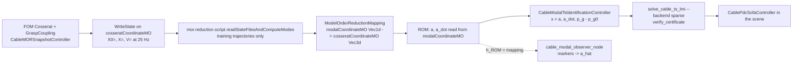

# SOFA strain-POD (MOR) pipeline for the cable TS-PDC

Status: **implemented and gated end to end; every number below is measured**
(`artifacts/cable_mor/*.yaml`). One host command runs it all and stops at the
first unsatisfied gate:

```bash
./scripts/run.sh cable_sofa_mor_pipeline     # ~1 h on the 7 GB host, idle
```

Each phase is also a command (`./scripts/run.sh cable_sofa_<phase>`), prints one
`CABLE_SOFA_<PHASE>_PASSED|FAILED` line and exits non-zero on failure:
`mor_plugin_test`, `mor_snapshots`, `mor_compute_modes`, `mor_validate`,
`modal_dataset`, `modal_ts_identify`, `modal_lmi`, `pdc_test`,
`modal_observer_test`. Settings and gate thresholds live in
[cable_mor.yaml](../src/cable_ts_control/config/cable_mor.yaml); the FOM
(`build_cable(..., reduction=None)`) stays the default plant everywhere.

## 1. One POD, one modal coordinate



* The basis `Phi_kappa` (48 x r, section-major `kappa_x, kappa_y, kappa_z`,
  reference `kappa_0 = 0`) is computed once by the plugin's own POD from the
  `WriteState` files of the **training** trajectories. The marker POD of
  `modal_basis.py` is not called anywhere in this chain; `ModalBasis.project`
  never touches `a`.
* `a` is the independent DOF of the SOFA ROM, the TS state and the PDC state.
  On the robot the same `a` is estimated by the visual observer through the
  ROM mapping (section 4); nothing re-fits a basis on markers.
* Planar case: rows `3s` and `3s+1` (torsion, out-of-plane bending) of every
  retained mode are zero (checked, tolerance 1e-10); the
  `PartialFixedProjectiveConstraint` stays on the FOM only, the ROM's strain
  state is mapped.

Pinned versions: SOFA v25.12.00, Cosserat `f64e029` (+ EI/GI patch),
ModelOrderReduction `d94dc49dff66d936ad11c33a8f195cc167c98b61` built from
source by [install_model_order_reduction.sh](../scripts/install_model_order_reduction.sh)
with three patches in `third_party/model-order-reduction-patches/`
(mapping-only build, assembled-Jacobian population so `SparseLDLSolver` sees the
mapped mass, lazy Python imports so the POD reader runs headless).

## 2. Snapshots and POD

* 4 physical vertices (`EI` x `rayleigh_stiffness` box) x 6 shared trajectories
  x 600 samples at 25 Hz (`control_dt = 0.04 s` = 4 SOFA steps), holds of 5 s at
  both ends, polar excitation in the annulus 0.92-0.985 L, `u[k]` drives
  `k -> k+1` (checked by `check_input_alignment`). Split by whole trajectories:
  train {0,1,2,3}, validation {4}, test {5}.
* `WriteState` writes 48 scalars per `X0=/X=/V=` line; timestamps and line
  counts are checked against the controller's own record (rtol 1e-5).
* `readStateFilesAndComputeModes(addRigidBodyModes=None)` over the 9600
  training snapshots; singular values 874 ... 1.1 for the 16 active modes, then
  8.5e-14 (numerical null space, refused by `rank_relative_tolerance`).

| tol | r | position projection | velocity projection |
|---|---|---|---|
| 0.2 | 3 | 13.1 % | 38.3 % |
| 0.1 | 4 | 8.9 % | 34.4 % |
| 0.05 | 6 | 3.2 % | 20.4 % |
| 0.02 | 8 | 1.5 % | 12.9 % |
| 0.01 | 9 | 0.97 % | 9.7 % |
| 0.005 | 12 | 0.41 % | 4.5 % |
| 0.001 | 16 | 1.5e-5 | 1.6e-5 |

## 3. FOM/ROM validation and the retained order

Same commands on FOM and ROM (`validate_cosserat_rom`): train trajectory 0,
validation 4, test 5, at the four vertices and the box centre; 600 s holds;
2 s projected rollouts. Limits (marker-space requirements of the existing
pipeline): marker rmse 5 mm, max 10 mm, tip 1 mm / 0.02 rad, strain 5 %,
chain length 1 mm.

| r | worst marker rmse | failing episodes | mean step ROM/FOM |
|---|---|---|---|
| 3 | 48.9 mm | 15/15 | 1.13x faster |
| 4 | 48.6 mm | 15/15 | 1.06x |
| 6 | 55.4 mm | 6/15 | 0.94x |
| 8 | 5.9 mm | 6/15 | 0.86x |
| 9 | 1.72 mm (max 17.4 mm) | 1/15 | 0.82x |
| 12 | 1.10 mm (max 10.2 mm) | 1/15 | 0.69x |
| **16** | **0.000 mm** | 0/15, holds 0/5 | **0.62x (slower)** |

The failing episode of r = 9 and 12 is always vertex 1 (EI = 0.005,
c_R = 0.022, softest) on validation trajectory 4, a large-deformation event.
**r = 16 is the full active rank**: the planar rod has 16 in-plane bending
strains, so the retained ROM is an exact change of coordinates of the FOM,
not a truncation. Consequences, stated plainly:

* no speed-up (mapping overhead, `BeamHookeLawForceField` still evaluated on
  all 16 sections; this is coordinate reduction, not hyper-reduction);
* the gain of the chain is the **single, hash-tracked strain coordinate**
  shared by plant, identification, control and observation, not accuracy;
* `x = [a, a_dot, p_g - p_g0]` has 34 states.

Lower orders were not promoted because they fail the fixed limits; loosening a
limit to promote r = 9 or 12 is a modelling decision to justify and revalidate,
not a knob.

## 4. Modal TS identification

`CableModalTsIdentificationController` fits, per physical vertex, 4 boundary
rules (`rho = [1 - |p_g|/L, atan2(p_g)]`) with `fit_modal_structured_model`:
the repository's second-order structured fit written in the **mass metric**
`M(a) = sum_f m_f J_f' J_f` computed from the scene mapping (condition number
~7e5). In raw strain coordinates `M^-1 K` is far from symmetric and the passive
projection of `fit_structured_fuzzy_model` destroyed the fit (held-out one-step
7-37 mm); in `z = L' a` it is meaningful and the exactly discretised
`(A_i, B_i)` are mapped back to `[a, a_dot, g]`. No input feed-through
(docs section 5.14), ridge 0.01 in `z`.

Held-out (validation 4, test 5), marker space through the scene mapping:

| vertex | one-step | windowed 2 s rollout | constant-velocity baseline |
|---|---|---|---|
| 0 | 0.67 / 0.83 mm | 41.8 / 49.7 mm | 60.6 / 111.8 mm |
| 1 | 0.69 / 0.82 mm | 41.4 / 48.5 mm | 78.4 / 114.7 mm |
| 2 | 0.65 / 0.65 mm | 37.9 / 44.5 mm | 43.8 / 79.7 mm |
| 3 | 0.64 / 0.64 mm | 37.6 / 44.4 mm | 45.4 / 79.2 mm |

Gate: one-step <= 5 mm, rollout <= 50 mm (the numbers of
`identify_ts_vertices`). The model passes, but the baseline column says how
much of the 2 s prediction is dynamics and how much is kinematics: the TS
model is a weak predictor of the transients, as the legacy marker-POD model was.

## 5. Observability of `a` from the camera

7 planar markers give 14 measurements, `r = 16`: **no instantaneous
reconstruction** (`rank J_y = 14 < r`, measured: 14 with all markers, down to 4
under 20 % occlusion; condition of the regularised normal matrix 89-108). The
observer is therefore the dynamic form of the specification:

`a_hat = argmin ||W^1/2 (y - h_ROM(a))||^2 + lambda ||a - a^-||^2`

with `h_ROM` the ROM graph itself (`ModalObservationModel`, 0.19 ms per
evaluation, finite-difference Jacobian), `W` the per-marker validity/covariance
and `a^-` the TS prediction from the previous state and the gripper's finite
difference (`prior_std` 0.2, `marker_std` 2 mm). Measured on the FOM truth
(validation trajectory, box centre), `cable_modal_observer.yaml`:

| | full visibility | 20 % random occlusion |
|---|---|---|
| marker reconstruction rmse of `a_hat` | 1.55 mm | 1.93 mm |
| `a` rmse / range of `a` | 0.40 | 0.43 |
| `a_dot` rmse (filtered) | 1.88 | 2.12 |
| update time (mean / max) | 14 / 19 ms | 14 / 23 ms |

Read the second row honestly: the two unobserved strain directions are filled
by the prior, so `a_hat` reproduces the **shape** to 2 mm but not the
individual high-mode coordinates. A target in marker space is converted to `a*`
by the same observer (`cable_modal_observer_node._on_target`).

## 6. LMI / PDC

`cable_sofa_modal_lmi` calls `solve_cable_ts_lmi` on the modal model after
checking `state_coordinates: cosserat_modal` and the basis hash, and writes
gains only when `verify_certificate` accepts them. cvxpy and Clarabel are
OOM-killed at 34 states (40 PSD blocks of 68 x 68, 6.4 GB RSS): the
`--backend sparse` option assembles the **same** inequalities column by column
for SCS (`lmi_synthesis._SparseSdp`, 95k rows, 1.7 M non-zeros, 580 MB,
~30 ms/iteration; unit-tested against cvxpy/Clarabel on the toy problem); the
verifier is unchanged and remains the gate. `--report` writes the attempt
record on every outcome (`cable_lmi_report.yaml`).

**Result: not certified. No gains file exists.** Two budgets, same verdict:

| conditions | SCS iterations | `res_pri` (plateau since ~4 500) | verification: worst block |
|---|---|---|---|
| basic | 6 000 | 1.12 | vertex 0, rule (3,3): residual +37 |
| relaxed | 6 000 | 1.19 | vertex 0, rule (1,1): residual +6.3 |
| basic | 20 000 | 1.09 | vertex 0, rule (0,0): residual +141 |
| relaxed | 20 000 | 1.51 | vertex 0, rule (1,1): residual +2.2 |

Mechanism (PBH test on the identified vertices, `artifacts/cable_mor/tmp/pbh.py`):
every rule has **7-22 uncontrollable eigen-directions with |lambda| in
[0.99998, 1]**, the controllability matrix has rank 15/34 with singular values
falling to 1e-12 of the largest beyond index 15. The barely excited high strain
modes come out of the fit as marginal integrators (their K and D rows sit on the
PSD floor) that two planar inputs cannot reach. Uncontrollable modes on the unit
circle admit no quadratic Lyapunov certificate whatever the gains, so this is a
property of the identified model, not of the solver: it is the strain-coordinate
form of the infeasibility documented in
[cable_ts_status_and_diagnosis.md](cable_ts_status_and_diagnosis.md) section 3.1.
What would change it is a modelling decision to justify and revalidate (a
non-zero damping floor tied to the measured Rayleigh damping, an excitation that
reaches the high modes, or a controlled/uncontrolled split of the state), not a
solver, margin or verifier knob.

`CablePdcSofaController` runs the loop inside the scene: `a, a_dot` from
`modalCoordinateMO`, causal velocity filter with the model's `velocity_alpha`,
`u = -sum h_i K_i (x - x*)`, saturation, and the command drives the grasp
target over the next control period (the dataset convention, asserted by
`check_input_alignment` on the closed-loop log and by
`test_sofa_pdc_controller.py`). `cable_sofa_pdc_test` runs it on the ROM with
the direct modal state and on the **FOM with the observer's estimate from noisy,
occluded markers**, both towards a settled equilibrium `[a*, 0, g*]`. It refuses
to start without certified gains, so it has **not been executed** on this model.

## 7. ROS 2 side (unchanged topics)

`cable_closed_loop_sim.launch.py state_coordinates:=cosserat_modal
ts_model_file:=... ts_gains_file:=... target_config:=.../cable_target_modal_rom.yaml`
replaces `cable_state_reducer_node` by `cable_modal_observer_node` (same
`/cable/reduced_state` contract, `state = [a, a_dot, p_g - p_g0]`) and passes
`strain_modes_metadata` to `cable_ts_controller_node`, which refuses a model,
gains or state of another coordinate type, order or basis hash
(`modal_contract.check_model_contract`). `cable_reference_projector_node` maps
the desired gripper pose to IBVS features and is coordinate-agnostic; it needed
no change. `cable_supervisor_node` compares the modal block of `[a*, g*]`.

## 8. Gate record (2026-09-08, start commit `2f90727`, MOR `d94dc49`)

`cable_sofa_mor_pipeline` runs the phases in the order below and stops at the
first failure. The observer gate is placed before the LMI because it does not
need gains and its result must not be hidden by a documented infeasibility.
The full command was run once from scratch (snapshots to LMI, ~50 min): every
gate up to and including the observer passed with the numbers of sections 2-5
reproduced bit-for-bit (same hashes), and it stopped at `modal_lmi`.

| gate | command | result |
|---|---|---|
| MOR mapping (Vec1d->Vec3d, apply/applyJ/applyJT, assembled mass) | `cable_sofa_mor_plugin_test` | PASSED |
| FOM/ROM graph + exact `save_state/restore_state` in both | `cable_sofa_mor_plugin_test --cable-modes ...` | PASSED |
| native snapshots, 4 vertices x 6 trajectories x 600 x 48 | `cable_sofa_mor_snapshots` | PASSED |
| official POD, 7 tolerances, planar rows zero, null space refused | `cable_sofa_mor_compute_modes` | PASSED (r = 3..16) |
| FOM/ROM on unseen trajectories + 600 s holds + 2 s rollouts | `cable_sofa_mor_validate` | PASSED, r = 16 promoted (section 3) |
| ROM dataset `a, a_dot (sofa/state), g, u` + alignment | `cable_sofa_modal_dataset` | PASSED, 14 400 samples |
| modal TS, 4 rules x 4 vertices, held-out marker space | `cable_sofa_modal_ts_identify` | PASSED (section 4) |
| observer rank/condition/errors/occlusion/time | `cable_sofa_modal_observer_test` | PASSED (section 5) |
| PDC LMI, basic then relaxed, verified | `cable_sofa_modal_lmi` | **FAILED: not certified, no gains** (section 6) |
| closed loop in the scene, ROM direct + FOM observer | `cable_sofa_pdc_test` | NOT RUN (needs certified gains) |
| existing Cosserat/Optimus gates after the `cosserat_model.py` change | `cable_plugin_test`, `cable_forward_test`, `optimus_smoke_test`, `cable_optimus_test`, `cable_optimus_pipeline --duration 60` | all PASSED (EI 0.10 % in the pipeline test) |
| unit tests | `cable_unit_tests` (pytest) | 124 + 29 passed (contract, observer, sparse LMI vs cvxpy, PDC convention, MatrixLoader format) |

Every artifact of the chain carries the strain-basis hash
(`beb83b3c...`), the dataset hash, the config hash and the two commits; the
nodes refuse anything that does not match (`modal_contract.py`).
